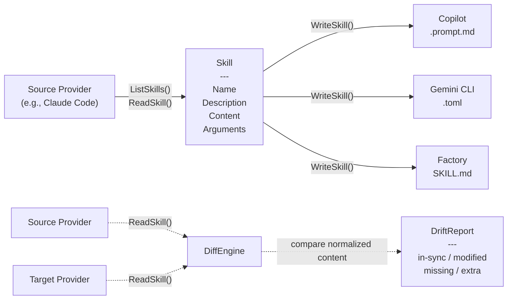

# skill-sync

Sync AI assistant skills across providers -- write once, use everywhere.

## The Problem

Every AI coding assistant has its own format for custom skills: Claude Code uses Markdown files, Copilot uses `.prompt.md`, Gemini CLI uses TOML, and Factory uses Markdown with YAML frontmatter. If you use more than one tool, you end up maintaining the same skills in multiple places, in multiple formats. When one copy drifts, you have no way to know until something breaks.

skill-sync fixes this. Declare one provider as your source of truth, and skill-sync translates and copies your skills to every target you configure. Then use `status` to catch drift before it becomes a problem.

## Quick Start

```bash
# Build from source
git clone https://github.com/user/skill-sync.git
cd skill-sync
go build -o skill-sync .

# Create a config file
./skill-sync init --source claude --targets copilot,gemini,factory

# Sync all skills
./skill-sync sync

# Check for drift
./skill-sync status
```

Or skip the config file entirely:

```bash
./skill-sync sync --source claude --targets copilot,gemini
```

## Usage

### `skill-sync init`

Creates a `.skill-sync.yaml` config file in the current directory.

```bash
skill-sync init --source claude --targets copilot,gemini,factory
```

```
Created .skill-sync.yaml (source: claude, targets: [copilot gemini factory])
```

### `skill-sync sync`

Reads skills from your source provider, translates the format, and writes them to all targets.

```bash
skill-sync sync
```

```
SKILL    TARGET   STATUS
deploy   copilot  synced
deploy   gemini   synced
deploy   factory  synced
search   copilot  synced
search   gemini   synced
search   factory  synced

Synced: 6  Errors: 0
```

Preview what would happen without writing anything:

```bash
skill-sync sync --dry-run
```

```
SKILL    TARGET   STATUS
deploy   copilot  would sync
deploy   gemini   would sync
deploy   factory  would sync

Would sync: 3 skill(s) to 3 target(s)
```

Sync only specific skills:

```bash
skill-sync sync --skill deploy --skill review
```

### `skill-sync status`

Compares skills in your source against all targets and reports drift. Exits with code 1 if any drift is detected.

```bash
skill-sync status
```

```
Target: copilot
SKILL    STATUS
deploy   [ok] in-sync
search   [!] modified
lint     [-] missing

Target: gemini
SKILL    STATUS
deploy   [ok] in-sync
search   [ok] in-sync
lint     [ok] in-sync
```

Status symbols:

| Symbol | Meaning |
|--------|---------|
| `[ok] in-sync` | Source and target content match |
| `[!] modified` | Both exist but content differs |
| `[-] missing` | Skill exists in source but not in target |
| `[+] extra` | Skill exists in target but not in source |

### `skill-sync diff [provider]`

Shows unified diffs for skills that differ between source and a target. If no provider is specified, shows diffs for all targets.

```bash
skill-sync diff copilot
```

```
--- a/search
+++ b/search
@@ -1,3 +1,3 @@
 # Search codebase
-Search for $ARGUMENTS in ${PROJECT} across all files.
+Search for $ARGUMENTS in src/ only.
 Return matching lines with context.
```

```bash
skill-sync diff         # diffs for all targets
```

## Architecture



The Skill struct is the intermediate representation. Every provider reads into it and writes from it. This is how a Markdown skill from Claude becomes a TOML file for Gemini -- the Skill model carries the content across the format boundary.

The DiffEngine reads skills from both source and target, normalizes whitespace, and compares. It produces a DriftReport for `status` and unified diffs for `diff`.

## Supported Providers

| Provider | Skill Location | Format | File Extension |
|----------|---------------|--------|----------------|
| Claude Code | `~/.claude/skills/<name>/` | Markdown | `SKILL.md` |
| GitHub Copilot | `.github/prompts/` | Markdown | `.prompt.md` |
| Gemini CLI | `~/.gemini/commands/` | TOML | `.toml` |
| Factory AI Droid | `.factory/skills/<name>/` | Markdown + YAML frontmatter | `SKILL.md` |

Claude and Gemini use user-level directories (under `$HOME`). Copilot and Factory use project-level directories (relative to the working directory).

## Configuration

The `.skill-sync.yaml` file declares your source provider, target providers, and an optional skill filter.

```yaml
# Source of truth -- skills are read from here
source: claude

# Target providers -- skills are synced to all of these
targets:
    - copilot
    - gemini
    - factory

# Optional: sync only these skills (empty = sync all)
skills: []
```

All commands accept `--config` to use a different config file path:

```bash
skill-sync sync --config my-config.yaml
```

You can also skip the config file entirely with `--source` and `--targets`:

```bash
skill-sync status --source claude --targets copilot,gemini
```

## How It Works

**sync** reads every skill from the source provider using `ListSkills()`, normalizes each into a `Skill` struct (name, description, content, arguments), then calls `WriteSkill()` on each target provider. Each provider handles its own format: Copilot writes `.prompt.md`, Gemini encodes a TOML file with `description` and `prompt` fields, Factory produces `SKILL.md` with YAML frontmatter.

**status** reads skills from both source and all targets, normalizes trailing whitespace, and compares content. It reports each skill as in-sync, modified, missing, or extra. If any drift is detected, it exits with code 1.

**diff** does the same comparison as `status` but produces unified diffs (like `git diff`) for modified skills instead of a status table.

Argument placeholders (`$ARGUMENTS`, `{{args}}`, etc.) are passed through verbatim. There is no cross-provider argument translation.

Sync is additive -- it writes source skills to targets but does not delete extra skills found in targets. The `status` command reports extras so you can handle them manually.

## CI Integration

Use `status` as a CI gate to catch skill drift on every push:

```yaml
name: Skill Sync Check
on: [push, pull_request]

jobs:
  skill-drift:
    runs-on: ubuntu-latest
    steps:
      - uses: actions/checkout@v4

      - uses: actions/setup-go@v5
        with:
          go-version: '1.22'

      - name: Build skill-sync
        run: go build -o skill-sync .

      - name: Check for skill drift
        run: ./skill-sync status
```

### Exit Codes

| Command | Exit 0 | Exit 1 |
|---------|--------|--------|
| `init` | Config created | Config exists, unknown provider, or validation error |
| `sync` | All skills synced | One or more skills failed to sync |
| `status` | All targets in-sync | Drift detected |
| `diff` | Always (diffs printed) | Provider resolution error |

## Contributing

```bash
# Build
go build -o skill-sync .

# Run all tests
go test ./...

# Lint
go vet ./...
```

The codebase is structured as:

```
cmd/           CLI commands (cobra)
internal/
  config/      Config loading and validation
  provider/    Provider interface + 4 implementations
  sync/        Sync engine + diff/drift engine
tests/         Smoke tests
```

When adding a new provider, implement the `provider.Provider` interface and call `provider.Register()` in an `init()` function. Add a row to the Supported Providers table above.

When changing CLI output format or flags, update the corresponding examples in this README.

## License

MIT
